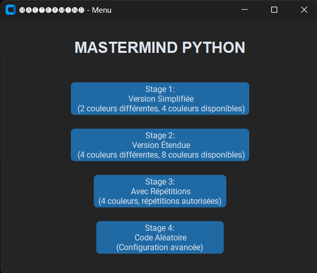
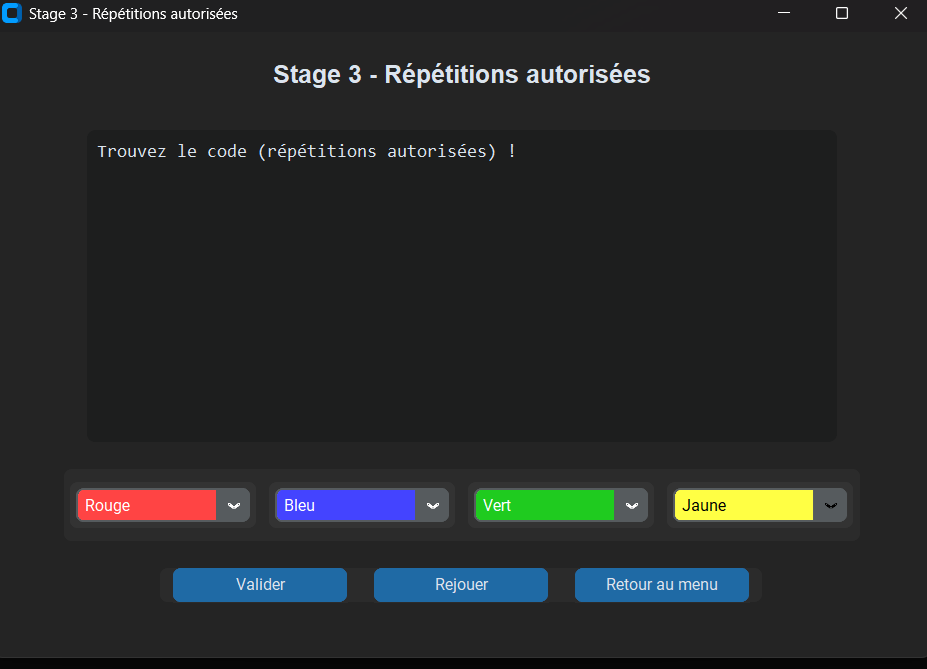

# Mastermind Python (Interface Graphique)

Ce projet est une implémentation du célèbre jeu **Mastermind** en Python avec une interface graphique réalisée grâce à la bibliothèque [CustomTkinter](https://github.com/TomSchimansky/CustomTkinter).

---

## Fonctionnalités

Le jeu propose **4 modes différents** accessibles depuis un menu principal :

1. **Stage 1 : Version Simplifiée**  
   - Code de 2 couleurs différentes  
   - 4 couleurs disponibles  
   - 6 essais maximum  

2. **Stage 2 : Version Étendue**  
   - Code de 4 couleurs différentes  
   - 8 couleurs disponibles  
   - Pas de répétitions autorisées  
   - 12 essais maximum  

3. **Stage 3 : Avec Répétitions**  
   - Code de 4 couleurs  
   - 8 couleurs disponibles  
   - Répétitions autorisées  
   - 12 essais maximum  

4. **Stage 4 : Code Aléatoire**  
   - Code généré aléatoirement  
   - 4 couleurs parmi 8 disponibles  
   - Répétitions possibles  
   - 12 essais maximum  

Chaque mode propose :  
✔️ Un affichage des tentatives  
✔️ Un retour sur les couleurs bien placées et mal placées  
✔️ La possibilité de rejouer ou revenir au menu  

---

## Installation

1. **Cloner le dépôt** :
   ```bash
   git clone https://github.com/ton-utilisateur/ton-repo.git
   cd ton-repo

2. **Créer un environnement virtuel (optionnel mais recommandé) :**
    ```bash
    python -m venv venv
    source venv/bin/activate   # sous Linux / macOS
    venv\Scripts\activate      # sous Windows


3. **Installer les dépendances :**
    ```bash
    pip install customtkinter

**Lancer le jeu**

Exécuter le fichier principal :

    ```bash
      python mastermind.py


Une fenêtre s’ouvrira avec le menu principal permettant de choisir un mode de jeu. Sinon, vous pouvez double cliqué sur votre fichier pour le lancer.

## Aperçu





## Explications hiérarchique du code
   ```swift
      MainMenu (CTk)
      │
      ├── Label "MASTERMIND PYTHON"
      ├── Boutons Stage 1 à Stage 4
      └── StageWindow (variable, une seule fenêtre à la fois)
            ├── Stage1App (CTkToplevel) ── Stage simplifié
            │   ├── Label titre
            │   ├── CTkTextbox feedback
            │   ├── Frame choix couleurs
            │   │   ├── ColorCombo (2 fois)
            │   │   │   ├── CTkComboBox (sélection couleur)
            │   │   │   └── Fond couleur + texte contrasté
            │   └── Frame boutons
            │       ├── Valider
            │       ├── Rejouer
            │       └── Retour au menu
            │
            ├── Stage2App (CTkToplevel) ── 4 couleurs différentes
            │   └── Même structure que Stage1 mais 4 ColorCombo
            │
            ├── Stage3App (CTkToplevel) ── Répétitions autorisées
            │   └── Même structure mais code_length = 4 et répétitions possibles
            │
            └── Stage4App (CTkToplevel) ── Code aléatoire
               ├── Génération aléatoire du code (random.choices ou sample)
               └── Même structure avec ColorCombo pour sélectionner les couleurs

      ColorCombo (CTkFrame) - utilisé dans tous les stages
      ├── CTkComboBox
      │   └── Affiche la couleur choisie
      ├── update_color() → met à jour le fond et le texte selon contraste
      └── get()/set() → récupérer ou définir la couleur sélectionnée

      Logic flow général :
      MainMenu -> ouverture Stage -> sélection couleurs via ColorCombo -> Valider -> check_proposal() -> feedback_text

--- 

## Notes

- Projet écrit en Python 3.9+ (compatibilité recommandée).

- Utilise CustomTkinter pour une interface moderne.

- Idéal pour apprendre la programmation d’UI en Python et la logique du jeu Mastermind.
